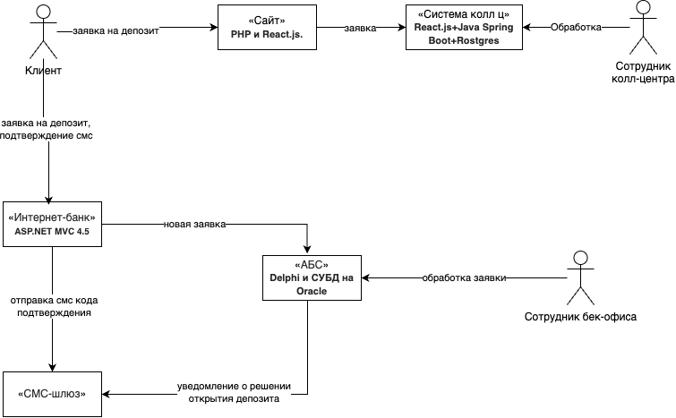
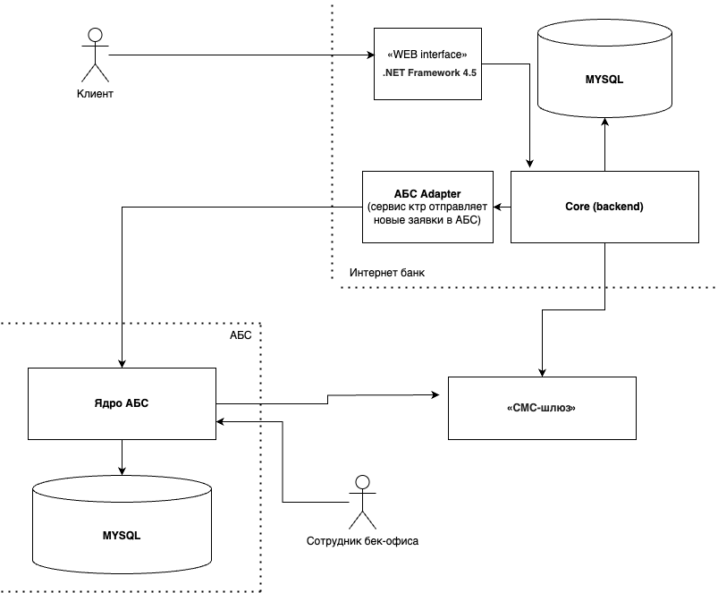

### **Название задачи:** Cхему концептуальной архитектуры открытия депозитов для MVP
### **Автор:** Evelik
### **Дата:** 8 may
### **Функциональные требования**

|  №  | Действующие лица или системы       | Use Case                                                       | Описание                                                                                                                                                                                                 |
| :-: | :--------------------------------- | :------------------------------------------------------------- | :------------------------------------------------------------------------------------------------------------------------------------------------------------------------------------------------------- |
|  1  | Клиент, сайт                       | Просмотр депозитов на сайте                                    | 1. Клиент находится на сайте в разделе депозитов 2. Клиент видит список доступных депозитов с актуальными ставками                                                                                    |
|  2  | Клиент, сайт                       | Заявка на  депозит через сайт                                  | 1. Клиент оставляет на сайте свой номер телефона и Ф. И. О. 2. Клиенту звонит менеджер кол-центра для подтверждения заявки 3. Клиент идет в отделение банка для идетификации                       |
|  3  | Сотрудник колл-центра, клиент, АБС  | Подтверждение заявки на депозит, сделанной через сайт          | 1. Сотрудник кол-центра видит новую заявку 2. Сотрудник кол-центра изучает заявку на прдемет особых условий 3. Сотрудник кол-центра звонит клиенту, предлагает особые условия, подтверждает заявку |
|  4  | Клиент, интернет-банк              | Просмотр депозитов в интернет-банке                            | 1. Клиент находится в интернет-банке в разделе депозитов 2. Клиент видит список доступных депозитов с актуальными ставками и персонализированные ставки лично для него                                |
|  5  | Клиент, интернет-банк, смс-шлюз    | Заявка на  депозит через интернет-банк                         | 1. Клиент создает заявку, указывая в ней счет и сумму депозита 2. Клиент подтверждает завку по смс. 3. После подтверждения размера ставки и открытия депозита клиент получит смс-уведомление       |
|  6  | Сотрудник бэк-офиса, АБС, смс-шлюз | Подтверждение заявки на депозит, сделанной через интернет-банк | 1. Сотрудник видит новую заявку на депозит 2. Сотрудник подтверждает условия депозита в АБС банка 3. Клиенту отправляется смс-уведомление
### **Нефункциональные требования**
| Код | Требования                         |
|-----|------------------------------------|
| R   | Надёжность (Reliability)           |
|     | При этом все сервисы должны работать 24/7 и быть доступны в 99,9% случаев|
|     | В случае сбоев в ЦОД необходимо, чтобы сервисы интернет-банка были доступны и выдерживали требуемую нагрузку |
| P   | Производительность (Performance)|
|     | Отклик по всем операциям должен быть максимально быстрым и занимать миллисекунды|
|     | Предусмотреть равномерное горизонтальное масштабирование|
||Предусмотреть распределение запросов между серверами, приложениями и ЦОД|
| S   | Поддерживаемость (Supportability)  |
|     | Предусмотреть разработку документации для дальнейшего расширения системы|
| +R  | + Ограничения (Restricitions)|
|     | Стоит учитывать, что с сайта передаётся чувствительная информация. Данные необходимо защищать с помощью механизма шифрования трафика.|
|     | При доработках во всех системах нужно как можно больше использовать технологии, которые уже есть в банке|
|     |Если нужны очереди сообщений, то лучше использовать Kafka на перспективу| стоит учитывать, что текущая версия платформы интернет-банка несовместима с ней|
|     |АБС может масштабироваться только вертикально|

### **Решение**
Диаграммы контекста

Диаграммы контейнера

1) Необходимо добавить необходимые страницы в интерфейс приложений (сайт/интернет-банк)
2) Дописать адаптер сервис для АБС, чтобы смочь разделить приложение и этот сервис (исключение прямого взаимодействия)
3) Добавить логику api для подключения шлюза с СМС оповещением

Мое решение обусловлено минимальным мвп, чтобы хватило на необходимый юзкейс

### **Альтернативы**
Самый простой способ внедрение брокера сообщений Kafka - это бы разгрузило сервис АБC и дало бы возможность масштабировать приложение с другими сервисами.

**Недостатки, ограничения, риски**

НО, во-первых, текущая реализация АБС не совместима с Kafka, на ее внедрение потребовалось бы изменение архиектуры многих сервисов, а это значит время, а это значит деньги. если вопрос стоит в скорейшем выпуске минимально работающего целевого продукта, то можно обойтись моим решением выше

