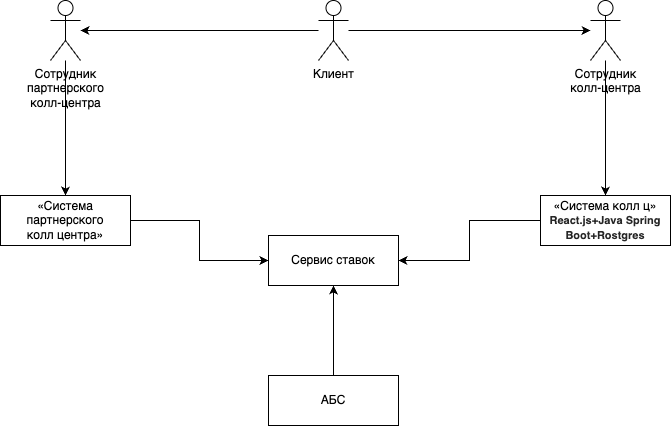
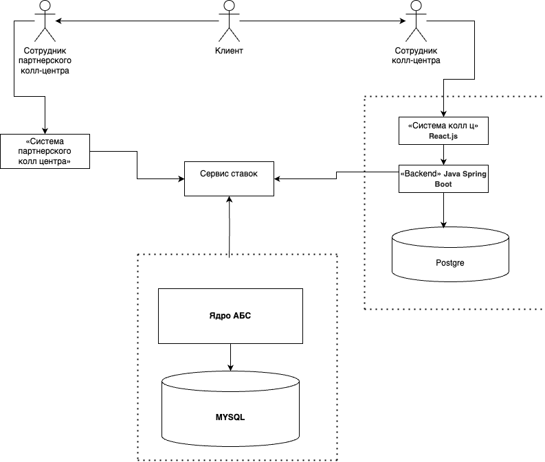


### **Название задачи:** Aрхитектурное решение для нового кейса
### **Автор:** Evelik
### **Дата:** 8 may
### **Функциональные требования**
Опишите здесь верхнеуровневые Use Cases. Их нужно оформить в виде таблицы с пошаговым описанием:

|**№**|**Действующие лица или системы**|**Use Case**|**Описание**|
| :-: | :- | :- | :- |
|| Клиент, звонок в колл-центр| уточнение текущих ставок банка|1. Клиент звонит сотруднику колл-центра банка 2. Сотрудник кол-центра банка смотрит текущие ставки в WebUI системы кол-центра банка, консультирует клиента|
||Клиент, звонок в партнерский колл-центр|уточнение текущих ставок банка|1. Клиент звонит сотруднику партнерского кол-центра банка 2. Сотрудник партнерского кол-центра смотрит текущие ставки в WebUI системы партнерского колл-центра банка, консультирует клиента|
||Система (партнеского) колл-центра|актуализация ставок банка| WebUI системы (партнеского) кол-центра банка получает актуальные данные через REST API сервиса ставок|

### **Нефункциональные требования**
| **№** | **Требование**                                                                                       |
| :---: | :--------------------------------------------------------------------------------------------------- |
|   R   | Надёжность (Reliability)                                                                             |
|       | Сервисы должны работать 24/7 и быть доступны в 99,9% случаев                                         |
|       | Избежать прямой работы систем кол-центров с API АБС                                                  |
|       |                                                                                                      |
|   P   | Производительность (Performance)                                                                     |
|       | Есть риск, что кол-центр будет перегружен                                                            |
|       |                                                                                                      |
|  +R   | + Ограничения (Restricitions)                                                                        |
|       | При актуализации данных по текущим ставкам необходимо защищать трафик с помощью механизма шифрования |
|       | Партнерский сервис может получать данные в виде файлов                                               |
### **Решение**
Диаграммы контекста

Диаграммы контейнера

сервис ставок будет с некоторой переодичностью получать обновление ставок от АБС - тем самым, сервисы колл центра и партнеров могут опрашивать его по (api и sftp) и получать сведения для клиентов
### **Альтернативы**
- передавать файл со ставками в партнерский сервис вручную через e-mail
-Запрашивать информацию напрямую из АБС

**Недостатки, ограничения, риски**
Важно обратить внимание на оптимальность срока и периодичность для обновлния, так как сотрудники могут получать не актуальную информцию

